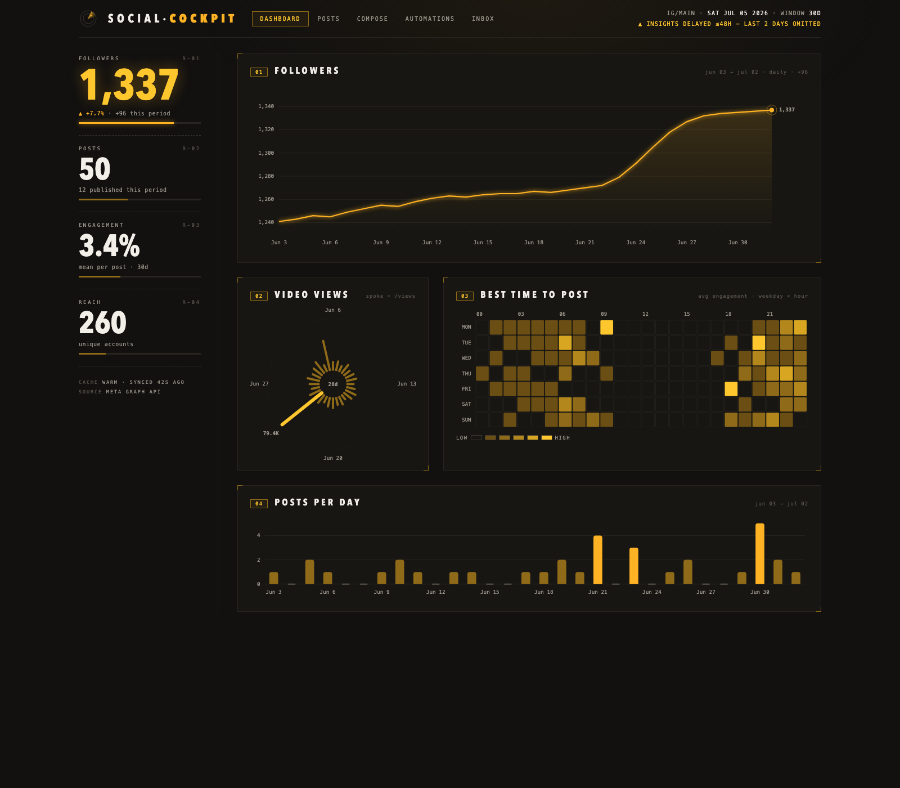

<div align="center">

# 🎛️ Social Cockpit

**A self-hosted command center for your Instagram presence — analytics, publishing, inbox, and hands-off engagement automations, all running on your own machine.**

[](https://nextjs.org)
[](https://react.dev)
[](https://www.typescriptlang.org)
[](https://tailwindcss.com)
[](https://developers.facebook.com/docs/instagram-platform)
[](#-quick-start)

<br />



</div>

---

## What is this?

**Social Cockpit** is a locally-run web app that puts a professional-grade dashboard on top of the Instagram Graph API. It's built for creators and social managers who want to **own their tooling and their data** — you run it yourself, it talks directly to Meta with your own credentials, and everything is stored in local SQLite files on your machine. Nothing is sent to a third-party service.

> [!IMPORTANT]
> This is a **self-managed** application. You bring your own Meta developer app and Instagram access token, and you host the app yourself (locally or on your own server). There is no hosted/SaaS version — you are in full control of your credentials and data.

### Platform support

| Platform | Status |
| --- | --- |
| **Instagram** (Business / Creator accounts) | ✅ Supported |
| TikTok | 🔜 On the roadmap |
| YouTube | 🔜 On the roadmap |
| X / Threads / LinkedIn | 🗓️ Under consideration |

Today, Social Cockpit targets **Instagram only**. The architecture is provider-agnostic where it can be, so additional platforms are planned.

---

## ✨ Features

- **📊 Dashboard ("Cockpit")** — Follower growth and video-views charts, headline readouts, and at-a-glance account health.
- **🗂️ Posts Explorer** — Cursor-paginated media browser with per-post insights, side-by-side post comparison, and top-post ranking by any metric.
- **📝 Compose Studio** — Draft and publish Reels/media: caption editor, tagging, distribution options, and a live Reel preview before you publish.
- **💬 Inbox** — Read and reply to comments in threaded view.
- **🤖 Engagement Automations** — A **comment → follow → DM** funnel: when someone comments a trigger keyword, the app can reply, check whether they follow you, and send a direct message (with nudges), all tracked with per-flow funnel counters. Built-in send throttling and an API usage meter keep you inside Meta's rate limits.
- **🎙️ Video Transcription (optional)** — A background worker transcribes your Reels/videos locally with [`faster-whisper`](https://github.com/SYSTRAN/faster-whisper) so you can search and rank by script content.
- **⚡ Smart local caching** — Media and insights are cached in local SQLite with stale-while-revalidate reads and background re-sync, minimizing API calls and rate-limit risk.
- **🔑 Token management** — Exchange short-lived tokens for long-lived ones in the UI, with automatic background refresh before expiry.

---

## 🧰 Requirements

Before you start, you'll need:

1. **Node.js 18.17+** and **npm** (this is a Next.js 14 app).
2. **An Instagram Professional account** — a **Business** or **Creator** account (personal accounts are not supported by the API).
3. **A Meta Developer account and app** — see [Setting up your Meta app](#-setting-up-your-meta-app) below.
4. *(Optional)* **Python 3.9+** — only if you want the local video-transcription feature.

---

## 🔧 Setting up your Meta app

Social Cockpit uses the **[Instagram API with Instagram Login](https://developers.facebook.com/docs/instagram-platform/instagram-api-with-instagram-login)** (Graph API `v25.0`, `graph.instagram.com`). You'll create your own Meta app and generate an access token for it.

1. **Create a Meta developer account** at [developers.facebook.com](https://developers.facebook.com/) and verify it.
2. **Create a new app** → choose the **Business** type.
3. **Add the "Instagram" product** to the app and configure **Instagram API setup with Instagram Login**.
4. **Connect your Instagram Professional account** to the app (as an app tester/role while in Development mode).
5. **Grant the permissions** the app uses. Because you run this only against **your own** connected account while the app is in Development mode, these scopes are available to you immediately — **no permission request, App Review, or submission to Meta is required.** Just select them when generating your token in the Graph API Explorer:
   - `instagram_business_basic` — read your profile, media, and insights
   - `instagram_business_manage_comments` — read and reply to comments
   - `instagram_business_manage_messages` — send direct messages (for automations)
   - `instagram_business_content_publish` — publish Reels/media from Compose
   - `instagram_business_manage_insights` — read post and account insights
6. **Grab your credentials:**
   - **Instagram account ID** — your app-scoped Instagram user ID.
   - **App Secret** — from **App settings → Basic** (used for automatic long-lived-token refresh).
   - **A short-lived access token** — generate one from the [Graph API Explorer](https://developers.facebook.com/tools/explorer/), then exchange it inside the app (**Settings → Exchange Short-Lived Token**) for a 60-day long-lived token.

> [!NOTE]
> While your app is in **Development mode** it works only for accounts with a role on the app — perfect for running your own cockpit. Going through Meta **App Review** is only necessary if you want to operate on accounts you don't control.

> [!WARNING]
> This project is **not affiliated with, endorsed by, or sponsored by Meta or Instagram**. You are responsible for complying with the [Meta Platform Terms](https://developers.facebook.com/terms/) and Instagram's policies when using your own app and tokens.

---

## 🚀 Quick start

```bash
# 1. Clone and install
git clone <your-fork-url> social-cockpit
cd social-cockpit
npm install

# 2. Configure your environment (see below)
cp .env.example .env.local
#   ...then edit .env.local with your credentials

# 3. Run
npm run dev
```

Open **[http://localhost:3000](http://localhost:3000)** in your browser. Head to **Settings** to exchange your short-lived token and confirm your connection.

For production:

```bash
npm run build
npm start   # serves on port 3000
```

---

## ⚙️ Configuration

Configuration lives in `.env.local` (git-ignored). Only the first three are required to get running.

### Required

```bash
# .env.local
INSTAGRAM_ACCESS_TOKEN=EAA...        # your long-lived Instagram token
INSTAGRAM_ACCOUNT_ID=17841400000000  # your Instagram (app-scoped) user ID
INSTAGRAM_APP_SECRET=abc123...       # Meta App Secret — enables auto token refresh
```

### Optional

```bash
# ── Storage (local SQLite; sensible defaults) ─────────────────────────
# DB_PATH=./data/app.db
# CACHE_DB_PATH=./data/cache.db
# TRANSCRIPTS_DB_PATH=./data/transcripts.db

# ── Token refresh ─────────────────────────────────────────────────────
# TOKEN_EXPIRES_AT=                    # ISO timestamp of current token expiry
# TOKEN_REFRESH_INTERVAL_MS=           # how often to check for refresh
# TOKEN_REFRESH_THRESHOLD_DAYS=        # refresh when this close to expiry

# ── Meta API cache ────────────────────────────────────────────────────
# CACHE_SYNC_INTERVAL_MS=1800000       # background re-sync cadence (30 min)
# CACHE_TTL_MS=1800000                 # freshness window before read-through refresh

# ── Video transcription (see below) ───────────────────────────────────
# TRANSCRIPTION_PYTHON=/abs/path/to/.venv/bin/python
# TRANSCRIPTION_MODEL=small            # whisper model; larger = slower/more accurate
```

> All application data (cache, transcripts, tokens, automation state) is stored locally in the git-ignored `data/` directory. Nothing leaves your machine except direct calls to the Instagram API.

---

## 🎙️ Video transcription (optional)

A background worker transcribes your Instagram videos/reels using [`faster-whisper`](https://github.com/SYSTRAN/faster-whisper). It boots with the server, re-scans for new videos every ~30 minutes, and runs one transcription at a time. Results are cached in `data/transcripts.db` and shown in the post detail panel.

Because transcription runs in Python, set up a local virtualenv:

```bash
python3 -m venv .venv
.venv/bin/pip install -r requirements.txt
```

Then point the app at it and (optionally) pick a model:

```bash
# .env.local
TRANSCRIPTION_PYTHON=/absolute/path/to/social-cockpit/.venv/bin/python
# TRANSCRIPTION_MODEL=medium   # default is "small"
```

Restart the server, then enable the feature from the **Settings** page. Both the toggle and `TRANSCRIPTION_PYTHON` are required — if either is missing, transcription simply stays off and the rest of the app is unaffected.

---

## 🏗️ How it works

```
┌─────────────────┐     read-through cache      ┌──────────────────────┐
│  Next.js app    │◄──────(SQLite, SWR)─────────│  Instagram Graph API │
│  (App Router)   │                             │       v25.0          │
│                 │──────direct API calls──────►│  graph.instagram.com │
└────────┬────────┘                             └──────────────────────┘
         │
         ├─ Cache worker        → data/cache.db      (media + insights, 30-min re-sync)
         ├─ Token manager       → auto long-lived refresh before expiry
         ├─ Automation worker   → comment → follow → DM funnel (60s tick)
         └─ Transcription worker→ data/transcripts.db (faster-whisper, Python)
```

- **Framework:** Next.js 14 (App Router) + React 18 + TypeScript
- **Styling:** Tailwind CSS, `next-themes` (light/dark), Recharts for charts
- **Data layer:** TanStack Query on the client; `better-sqlite3` for local persistence
- **API layer:** typed Instagram Graph API client with built-in rate-limit parsing and throttling

---

## 📁 Project structure

```
src/
├── app/            # App Router pages: dashboard, posts, inbox, compose, automations, settings
├── components/     # UI + feature components (cockpit, posts, inbox, compose, automations, settings)
├── hooks/          # TanStack Query hooks
└── lib/
    ├── instagram/  # Graph API client, endpoints, rate limiting
    ├── cache/      # local media/insights cache + background sync
    ├── token/      # long-lived token manager & auto-refresh
    ├── transcription/  # faster-whisper worker (Python bridge)
    └── automation-*    # engagement automation engine
scripts/transcribe.py   # Python transcription entrypoint
```

---

## 🔒 Security & data ownership

- Your access token and app secret live only in your local `.env.local` and are used **only** for direct calls to Meta.
- All caches and databases are local SQLite files under `data/` (git-ignored).
- No analytics, telemetry, or third-party backends. **Your data stays on your machine.**

---

## 🤝 Contributing

Contributions are welcome! Whether it's a bug fix, a new platform integration, or docs improvements — open an issue to discuss, or send a PR. Please keep changes focused and match the existing code style.

---

## 📄 License

Released under the [MIT License](LICENSE) unless otherwise noted. You are responsible for your own use of the Instagram/Meta APIs under their respective terms.

---

<div align="center">
<sub>Not affiliated with Meta Platforms, Inc. Instagram is a trademark of Meta Platforms, Inc.</sub>
</div>
